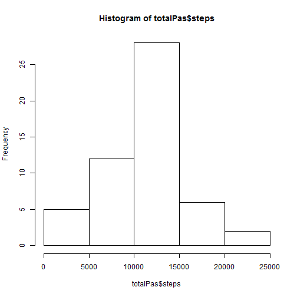
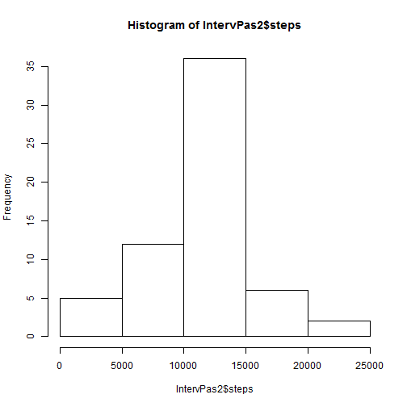

## Loading and preprocessing the data

- Load the data (i.e. read.csv())

```r
  if (!file.exists("activity.csv")) {unzip("activity.zip")}
  dados <- read.csv("activity.csv")
```

- Process/transform the data

```r
  dados$date<-as.Date(dados$date)
  totalPas <- aggregate(steps ~ date, data = dados, sum, na.rm = TRUE)
```


## What is mean total number of steps taken per day?


- Make a histogram of the total number of steps taken each day


```r
hist(totalPas$steps)
```

 

- Calculate and report the mean and median total number of steps taken per day


```r
options(scipen=999)
m <- format(mean(totalPas$steps),digits=0)
mm <- format(median(totalPas$steps),digits=0)
```

- The **mean** of total number of steps/day is **10766** steps.
- The **median** of total number of steps/day is **10765** steps.


## What is the average daily activity pattern?

- Make a time series plot (i.e. type = "l") of the 5-minute interval (x-axis) and the average number of steps taken, averaged across all days (y-axis)


```r
IntervPas <- aggregate(steps ~ interval, data = dados, mean, na.rm = TRUE)
plot(IntervPas, type="l")
```

 

- Which 5-minute interval, on average across all the days in the dataset, contains the maximum number of steps?


```r
Max_Int <- IntervPas[which.max(IntervPas$steps), ]$interval
```

The interval is the **835th**.

## Imputing missing values

- Calculate and report the total number of missing values in the dataset (i.e. the total number of rows with NAs)


```r
N_NAs <- sum(is.na(dados))
```
**2304** rows are "NAs"

- Devise a strategy for filling in all of the missing values in the dataset. The strategy does not need to be sophisticated. For example, you could use the mean/median for that day, or the mean for that 5-minute interval, etc.

**Ok. My strategy will be *mean for that 5-minute interval*. Therefore, I created this function as first pass.**


```r
x <- function(interval) {
    IntervPas[IntervPas$interval == interval, ]$steps
}
```

- Create a new dataset that is equal to the original dataset but with the missing data filled in.


```r
new_dados <- dados  
count = 0  
for (i in 1:nrow(new_dados)) {
    if (is.na(new_dados[i, ]$steps)) {
        new_dados[i, ]$steps <- x(new_dados[i, ]$interval)
        count = count + 1
    }
}
```

- Make a histogram of the total number of steps taken each day and Calculate and report the mean and median total number of steps taken per day. 


```r
IntervPas2 <- aggregate(steps ~ date, data = new_dados, sum)
hist(IntervPas2$steps)
```

 

```r
m2 <- format(mean(IntervPas2$steps),digits=0)
mm2 <- format(median(IntervPas2$steps),digits=0)
```

The **mean** total number of steps taken per day is **10766** steps.

The **median** total number of steps taken per day is **10766** steps.

- Do these values differ from the estimates from the first part of the assignment? What is the impact of imputing missing data on the estimates of the total daily number of steps?

**The difference between values is insignificant. Evidently it'll depend of the strategy to fill the NAs.**

## Are there differences in activity patterns between weekdays and weekends?

- Create a new factor variable in the dataset with two levels -- "weekday" and "weekend" indicating whether a given date is a weekday or weekend day.


```r
new_dados$day = ifelse(as.POSIXlt(as.Date(new_dados$date))$wday%%6 == 
    0, "weekend", "weekday")
# For Sunday and Saturday : weekend, Other days : weekday
new_dados$day = factor(new_dados$day, levels = c("weekday", "weekend"))
```

- Make a panel plot containing a time series plot (i.e. type = "l") of the 5-minute interval (x-axis) and the average number of steps taken, averaged across all weekday days or weekend days (y-axis).


```r
IntervPas2 = aggregate(steps ~ interval + day, new_dados, mean)
library(lattice)
xyplot(steps ~ interval | factor(day), data = IntervPas2, aspect = 1/2, 
    type = "l")
```

 
